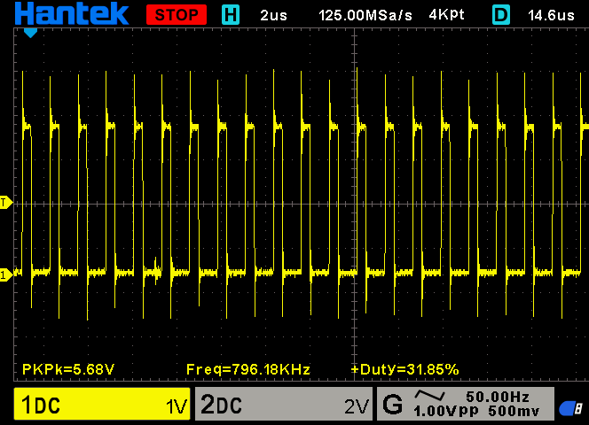
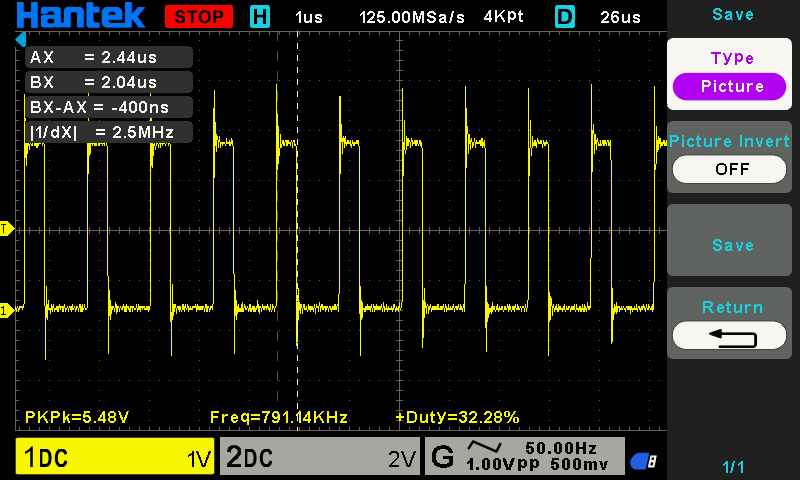

# How It Works

## System Overview

The WS2812B LEDs are controlled by generating a precisely timed PWM waveform on an STM32F411CEU6 ("Black Pill").

The STM32 uses:

* **TIM1 Channel 1** to generate the PWM waveform.
* **PA8 / TIM1_CH1** as the data output.
* **DMA** to continuously load new PWM compare values from memory into the timer.
* A software color buffer to store the desired color of each LED.
* A PWM/DMA buffer containing the encoded waveform.

The LEDs retain their displayed color after transmission. A new transmission is only required when the displayed colors need to change.

---

## Hardware Setup

The current setup uses an STM32F411CEU6 Black Pill and WS2812B LEDs.

The STM32 generates a 3.3 V logic-level data signal while the LEDs are powered from 5 V.

### Connections

| Component          | STM32 Pin                   | Notes                        |
| ------------------ | --------------------------- | ---------------------------- |
| WS2812B data input | PA8 / TIM1_CH1              | PWM data output              |
| WS2812B power      | 5 V supply                  | LEDs powered from 5 V        |
| WS2812B ground     | GND                         | Must share ground with STM32 |
| STM32 power        | USB / appropriate 5 V input | Depends on Black Pill setup  |

The oscilloscope is connected to PA8 to verify the generated waveform.



The measured PWM frequency is approximately **796 kHz**, which is sufficiently close to the nominal WS2812B protocol frequency of 800 kHz.

### Logic Level

The STM32 outputs 3.3 V logic while the WS2812B is powered at 5 V.

Many WS2812B variants accept this successfully (including every single one i've tested), but 3.3 V data is not guaranteed for every WS2812B variant or under every power condition.

If reliable operation cannot be achieved, a suitable 5 V logic-level shifter can be added between PA8 and the WS2812B data input.

---

## WS2812B Data Protocol

WS2812B LEDs use a single-wire, timing-based serial protocol.

Each LED receives 24 bits of data:

```text
MSB First
↓
G G G G G G G G
R R R R R R R R
B B B B B B B B
```

The first LED consumes its first 24 bits and forwards the remaining data to the next LED in the chain.

The waveform is generated by changing the PWM duty cycle for every transmitted bit.

The color order is **GRB**.

Bits are transmitted **MSB first**.

For example, a green value of:

```text
00000001
```

is transmitted as:

```text
0 0 0 0 0 0 0 1
```

The software color buffer is currently expected to use:

```c
led_data[LED][0] = Green;
led_data[LED][1] = Red;
led_data[LED][2] = Blue;
```

This allows the encoding loop to transmit the three color components directly in GRB order.

### Timing

STM32's SYSCLOCK is set to operate at 100MHz

The controller timer TIM1 runs at 100 MHz.

With:

```text
Prescaler = 0
ARR       = 124
```

the timer counts 125 clock ticks per PWM period:

```text
125 / 100 MHz = 1.25 µs
```

Therefore:

```text
PWM frequency ≈ 800 kHz
```

Each WS2812B bit occupies one PWM period.

The current encoding uses:

```text
CCR = 40 → logic 0
CCR = 80 → logic 1
CCR = 0  → low/reset period
```

At a 100 MHz timer clock:

```text
40 ticks = 400 ns
80 ticks = 800 ns
125 ticks = 1.25 µs
```



The oscilloscope measured approximately 400 ns for the CCR=40 pulse, which is consistent with the intended timing.

| Symbol  | High Time |                 Low Time | Total Time |
| ------- | --------: | -----------------------: | ---------: |
| Logic 0 |   ~400 ns |                  ~850 ns |    1.25 µs |
| Logic 1 |   ~800 ns |                  ~450 ns |    1.25 µs |
| Reset   |      0 ns | 1.25 µs per buffer entry |     ≥50 µs |

The reset time is currently generated by sending 40 zero-duty PWM entries:

```text
40 × 1.25 µs = 50 µs
```

This provides the low period required by the LEDs to latch the received data.

---

## STM32 Peripheral Configuration

The waveform is generated using **TIM1 PWM + DMA**.

No external WS2812 library is used.

### Timer

The STM32 clock configuration is:

```text
SYSCLK = 100 MHz
APB1   = 50 MHz
APB2   = 50 MHz
```

TIM1 is connected to APB2.

Because the APB2 prescaler is not 1, the STM32 timer clock is doubled:

```text
TIM1 clock = 100 MHz
```

TIM1 configuration:

```text
Timer:              TIM1
Channel:            CH1
Output pin:         PA8
Prescaler:          0
Counter period:     124
Counter mode:       Up
Clock division:     DIV1
Auto-reload preload: Enabled
```

The resulting PWM period is:

```text
(124 + 1) / 100 MHz
= 1.25 µs
≈ 800 kHz
```

The important CubeMX setting for startup behavior is:

```c
sConfigOC.Pulse = 0;
```

The initial PWM compare value must be zero.

Leaving the initial Pulse to 40 caused an unwanted PWM pulse during startup. Setting it to zero ensures that the output begins low.

### DMA

DMA is configured for TIM1 Channel 1.

Current configuration:

```text
Direction:            Memory → Peripheral
Mode:                 Normal
Peripheral increment: Disabled
Memory increment:     Enabled
Peripheral width:     Half Word
Memory width:         Half Word
Priority:             High
```

The DMA transfers one PWM compare value for every WS2812B bit.

For example:

```c
pwm_buffer[0] = 40;
pwm_buffer[1] = 80;
pwm_buffer[2] = 40;
```

causes the timer to use those values as successive PWM compare values.

The DMA therefore allows the CPU to prepare the complete waveform in memory and then have the timer transmit it automatically.

DMA is configured in **Normal** mode rather than Circular mode because each WS2812B update is a finite transmission followed by a reset/latch period.

### GPIO

PA8 is configured as:

```text
Alternate Function
TIM1_CH1
```

The pin outputs the TIM1 PWM waveform directly.

The oscilloscope can be connected to PA8 to inspect the waveform.

---

## Data Encoding

The application stores the desired LED colors separately from the waveform used for transmission.

For example:

```c
uint8_t led_data[NUM_LEDS][3];
```

The PWM buffer is large enough to contain:

```text
24 PWM values per LED
+
reset entries
+
one optional leading zero
```

For example:

```c
uint16_t pwm_buffer[
    NUM_LEDS * 24
    + WS2812_RESET_BITS
    + 1
];
```

The `+1` is for the leading zero used as a workaround for an observed DMA startup issue. (more on that later)

### Color Representation

The current representation is:

```text
led_data[LED][0] = G
led_data[LED][1] = R
led_data[LED][2] = B
```

For example:

```c
led_data[0][0] = 0;    // Green
led_data[0][1] = 255;  // Red
led_data[0][2] = 0;    // Blue
```

represents a fully red first LED.

Brightness can be controlled simply by changing the RGB values.

For example:

```text
R = 255 → full red
R = 128 → approximately half red
R = 0   → red off
```

No separate brightness mechanism is required for the basic driver.

OR

Use a function i made to do exactly that in traditional **RGB**
```c
WS2812_SetPixel(int index, int red, int green, int blue);
```

### Buffer Generation

`WS2812_Show()` converts every color bit into a PWM compare value.

The MSB is tested first:

```c
if (led_data[index][colorIndex] & (0x80 >> bitIndex))
{
    pwm_buffer[pwm_index++] = 80;
}
else
{
    pwm_buffer[pwm_index++] = 40;
}
```

Therefore:

```text
bit = 0 → CCR = 40
bit = 1 → CCR = 80
```

The encoding process is:

```text
For every LED
    For Green, Red, Blue
        For each bit, MSB first
            0 → 40
            1 → 80
```

After all LED data has been encoded, zero-duty entries are appended for the reset/latch period.

---

## Data Transmission

A blocking `WS2812_Show()` function is currently used.

The complete sequence is:

1. Prepare LED color data.
2. Reset the PWM buffer index.
3. Add a leading zero.
4. Convert every LED color bit into a PWM compare value.
5. Append the reset/latch zeros.
6. Start TIM1 PWM with DMA.
7. Wait for the DMA transfer to finish.
8. Stop the PWM/DMA transmission.
9. Return from `WS2812_Show()`.

The conceptual implementation is:

```c
volatile uint8_t ws2812_done = 0;

void WS2812_Show(void)
{
    uint16_t pwm_index = 0;

    ws2812_done = 0;

    // Leading low period
    pwm_buffer[pwm_index++] = 0;

    // Encode LED data
    for (int index = 0; index < NUM_LEDS; index++)
    {
        for (int colorIndex = 0; colorIndex < 3; colorIndex++)
        {
            for (int bitIndex = 0; bitIndex < 8; bitIndex++)
            {
                if (led_data[index][colorIndex] & (0x80 >> bitIndex))
                {
                    pwm_buffer[pwm_index++] = 80;
                }
                else
                {
                    pwm_buffer[pwm_index++] = 40;
                }
            }
        }
    }

    // Reset / latch
    for (int index = 0; index < WS2812_RESET_BITS; index++)
    {
        pwm_buffer[pwm_index++] = 0;
    }

    HAL_TIM_PWM_Start_DMA(
        &htim1,
        TIM_CHANNEL_1,
        (uint32_t *)pwm_buffer,
        pwm_index
    );

    while (!ws2812_done)
    {
    }
}
```

The DMA completion callback is used to signal that the complete DMA transfer has finished:

```c
void HAL_TIM_PWM_PulseFinishedCallback(TIM_HandleTypeDef *htim)
{
    if (htim->Instance == TIM1)
    {
        ws2812_done = 1;
    }
}
```

The callback is associated with completion of the DMA-driven PWM transfer, not with every individual PWM period.

The `volatile` keyword is important because `ws2812_done` is modified from interrupt/callback context while it is read by the main code.

Because the reset zeros are included in the DMA buffer, the callback occurs only after the reset/latch period has also been transmitted.

---

## LED Chain Behavior

WS2812B LEDs are connected in a daisy chain.

The STM32 sends the complete sequence to the first LED:

```text
STM32
  │
  ▼
LED 0
  │
  ▼
LED 1
  │
  ▼
LED 2
  │
  ▼
...
```

Each LED consumes exactly 24 bits and passes on the rest.

For two LEDs, the transmission therefore contains:

```text
LED 0:
24 bits

LED 1:
24 bits

Reset:
≥50 µs low
```

The first LED consumes the first 24 bits and passes the remaining bits along the chain.

This means the entire LED chain should be updated in **one transmission** rather than sending each LED separately.

---

## Important Implementation Details

* The WS2812B protocol uses **GRB**, not RGB ordering.
* Bits are transmitted **MSB first**.
* Each LED requires exactly **24 bits**.
* Each bit occupies **1.25 µs**.
* `CCR = 40` represents a logic 0.
* `CCR = 80` represents a logic 1.
* `CCR = 0` produces a low period.
* `ARR = 124` produces a 1.25 µs PWM period with a 100 MHz timer clock.
* The timer's initial CubeMX `Pulse` value should be **0**.
* DMA uses half-word transfers because `pwm_buffer` is a `uint16_t` array.
* The DMA buffer must be large enough for every LED bit plus the reset period.
* The DMA transfer length should match the number of populated entries in the buffer.
* A separate color buffer is useful because it keeps the desired LED state independent from the timing-specific PWM buffer.
* The LEDs retain their state after transmission, so the MCU does not need to continuously resend the data.
* `WS2812_Show()` can be called whenever the displayed LED state needs to change.
* The current `Show()` implementation is intentionally blocking.

### First-DMA-Transfer Workaround

An intermittent DMA startup issue has been observed on the current Black Pill hardware.

The symptom is that the first PWM value can occasionally appear to be held for approximately one additional PWM period.

Without a workaround, if the first actual data bit is:

```text
CCR = 80
```

the beginning of the transmission can effectively become:

```text
80 → 80 → ...
```

This can produce an excessively long first high pulse and cause incorrect LED data, such as an unexpectedly bright green LED.

The current workaround is to prepend a zero-duty PWM entry:

```c
pwm_buffer[pwm_index++] = 0;
```

This changes the possible failure mode from:

```text
DATA LOW x2 which consequently is DATA HIGH
```

to:

```text
LOW
LOW
DATA HIGH
```

An additional low period at the beginning of the transmission does not corrupt the first WS2812B data bit. It is simply extra low time before the actual data begins.

This workaround therefore makes the observed first-transfer timing problem effectively harmless from the WS2812B's perspective.

### Feedback needed

The root cause of the intermittent DMA behavior has not yet been determined. Testing on different STM32 hardware should help determine whether the issue is hardware-specific or caused by the current configuration/software.

---

## Troubleshooting

### LEDs Do Not Light Up

Check:

* WS2812B has a stable 5 V supply.
* STM32 and LED strip share a common ground.
* PA8 is connected to the **DIN** side of the first LED.
* The data direction through the LED chain is correct.
* TIM1 CH1 is actually configured on PA8.
* DMA is configured for TIM1 CH1.
* `HAL_TIM_PWM_Start_DMA()` is being called.
* The PWM frequency is approximately 800 kHz.
* The waveform is visible on the oscilloscope.
* The reset/latch period is sufficiently long.
* The specific WS2812B variant accepts 3.3 V logic.

If 3.3 V logic is unreliable, use a suitable level shifter.

### Incorrect Colors

Check the color order.

WS2812B normally expects:

```text
G → R → B
```

not:

```text
R → G → B
```

The current software therefore assumes:

```c
led_data[index][0] = G;
led_data[index][1] = R;
led_data[index][2] = B;
```

Also verify that bits are transmitted MSB first:

```c
0x80 >> bitIndex
```

A color-order problem usually produces consistently wrong colors, while a timing problem can produce seemingly random or unstable colors.

### Flickering or Unstable Output

Check:

* 5 V power stability.
* Common ground between the STM32 and LEDs.
* Data waveform timing with the oscilloscope.
* PWM frequency.
* High pulse widths for logic 0 and 1.
* DMA configuration.
* DMA interrupt configuration.
* Whether the first PWM value is occasionally being held too long.
* Whether the PWM buffer is being modified while DMA is transmitting it. (Artificial blocking was itroduced into `WS2812B_Show()` to fight exactly that) 

The current first-transfer workaround is:

```c
pwm_buffer[pwm_index++] = 0;
```

The timer should also start with:

```c
sConfigOC.Pulse = 0;
```

### Only the First LED Works

Check:

* The LEDs are connected in the correct DIN → DOUT direction.
* The transmission contains exactly `24 * NUM_LEDS` data values.
* The reset period occurs only after all LED data.
* The DMA transfer length includes the entire buffer.
* The LED data is encoded in GRB order.
* The second LED's data is actually present in `pwm_buffer`.

For example, two LEDs require:

```text
24 + 24 = 48 data bits
```

followed by the reset period.

A two-LED test can therefore be inspected directly with the oscilloscope.

---

## Possible Improvements

* Determine the root cause of the intermittent first-DMA-transfer issue by testing on different STM32 hardware.
* Investigate whether the DMA startup behavior can be eliminated through timer/DMA configuration rather than relying on the leading-zero workaround.
* Add a timeout to the blocking `WS2812_Show()` function so a failed DMA transfer cannot leave the program stuck forever.
* Convert `WS2812_Show()` to a non-blocking function if the application needs to perform other work during LED transmission.
* Add helper functions such as:

  * `WS2812_SetAll()`
  * `WS2812_Clear()`
* Add a configurable timing definition instead of hard-coding `40` and `80`.
* Add bounds checking to prevent writing beyond the PWM buffer.
* Use `pwm_index` as the DMA length so that changes to the buffer structure cannot accidentally leave the transfer length incorrect.
* Add a 5 V logic-level shifter if the particular WS2812B devices prove unreliable with the STM32's 3.3 V output.
* Increase the number of LEDs and verify that the DMA buffer remains within available STM32 RAM.
